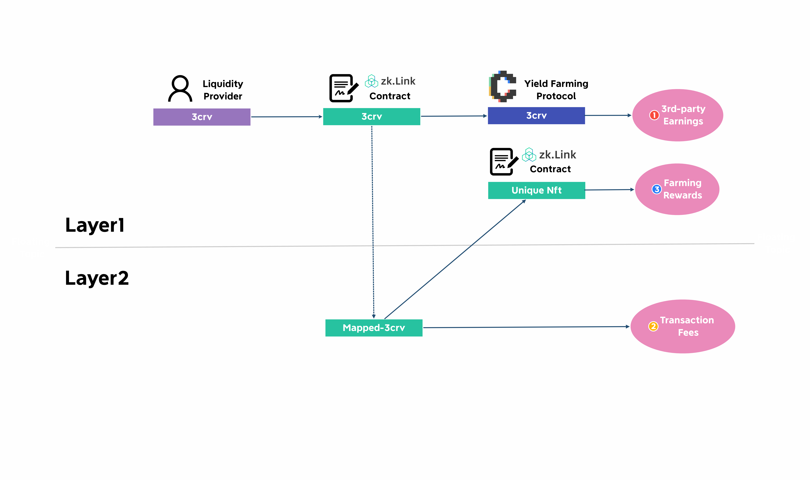

# L2 Liquidity

---

AMM-based, Layer2 liquidity pools composed of LP tokens from two separate chains. LP providers would receive rewards by easy steps without first depositing to L2, fully utilizing the LP tokens they’ve earned from other DEXs - reaping three times with one single stake.

> **🥇** Features
- Two sets AMM curves for different types of swaps: a stablecoin-specialized curve, and an AMM curve for other types.
- Easy earning with no extra effort by staking LP tokens ALREADY EARNED from other AMM protocols.

## One-coin LP
Most AMM protocols require LP providers to add both kinds of tokens by a certain ratio, which intangibly raises the threshold especially when it comes to cross-chain assets: users may use different wallets for each chain, and they will have to switch network and run the whole process again with much more clicks. It lowers users’ und utilization rate and increases their opportunity cost. To solve this problem, zkLink refers to Curve.fi’s algorithm and allows liquidity providers to add liquidity with only one kind of token, at how many they want.

## Reward Design
Users can provide liquidity to zkLink Layer2 liquidity pools on Layer1, and earn triple forms of income.

Take 3CRV(Ethereum)-3EPS(Solana) as an example - when a user adds 3CRV liquidity from its Ethereum Layer1 wallet, instead of locking up on zkLink's Layer1 smart contract, zkLink stakes it to one of the yield farming protocols such as Convex, helping the liquidity provider to secure the first half of earnings. In the meantime, zkLink mints the same amount of mapped-3CRV on our Layer2 network, adds liquidity to the correct pool, generating the second half for the LP. When the LP chooses to remove liquidity or to harvest earnings, the two parts of earnings will be collected together and received at once.

When a user provides liquidity into a pool, a unique NFT (ERC-721) which can be seen as liquidity tokens on other Dexs will be minted and sent to the provider's Layer1 address. This NFT represents the LP's contribution (or "share") to the given liquidity pool, and can be further staked to zkLink Layer1 contract in order to receive farming rewards.

